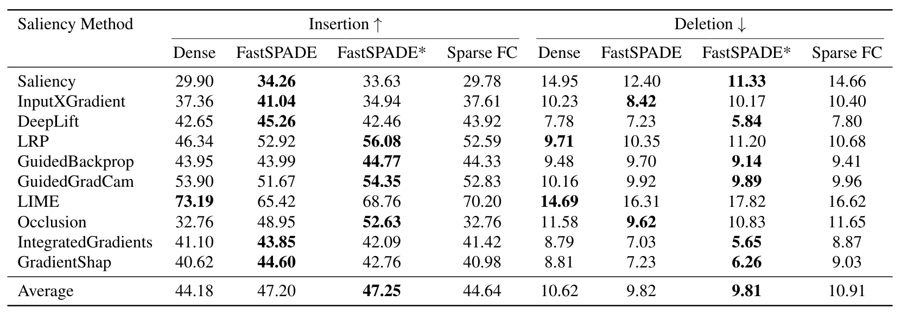

# SPADE: Sparsity Guided Debugging for Deep Neural Networks

This repository contains the code for the paper "[SPADE: Sparsity Guided Debugging for Deep Neural Networks](https://arxiv.org/abs/2310.04519)". In this paper we improved interpretability methods by first pruning the model on the sample of interest and then apply the interpretability method. This approach let we apply global interpretability methods as a local interpretability. We showed with our experiments that this approach will improve the interpretability methods preformance including feature visualization and saliency maps. 

# Illustration

**Figure 1:** SPADE disambiguates feature visualizations and improves the faithfulness of saliency maps.  (Left) The "Lighter, igniter" class neuron visualization does not give useful clues for why the Matchstick and Spotlight images were incorrectly classified into that class. The visualizations obtained with SPADE identify a matchstick head pattern in the first case and a flame pattern in the second case, suggesting that these may be spurious features for the Lighter class. (Right) A model implanted with Trojan patches leads to a Fox image being misclassified as a Goose. In this case, we are confident that the heart emoji was entirely responsible for the misclassification - yet, the saliency map without SPADE incorrectly assigns large saliency scores to large parts of the fox image. Conversely, the saliency map obtained with SPADE correctly identifies the emoji pixels. Best viewed in color. Further examples are available in Appendix

<b>Figure 2:</b> The overall SPADE procedure: given an image and a model, SPADE prunes the model using image augmentations. The resulting sample-aware trace (subnetwork) can be then used together with any interpretability method.

# Experimental Results
## Saliency Maps
<b>Table 1:</b> Saliency map Trojan AUC % on ResNet50/ImageNet, averaged across 111 test samples, compared to the dense model, and to the Sparse FC method of Wong et al. (2021).

<b>Table 2:</b> Insertion Metric AUC % on clean inputs, compared to the dense model, and to the Sparse FC method of Wong et al. (2021). FastSPADE* refers to FastSPADE with layer sparsity targets tuned using the insertion metric.

## Feature Visualization
<b>Table 3:</b> Results of human evaluation, measuring the ability of the evaluators to use neuron visualizations to attribute a classification decision to one of two image patches.

# Preliminaries

It is tested under Ubuntu Linux 20.04.3 LTS and Python 3.8.10 environment, and requires some packages to be installed:
* [PyTorch](https://pytorch.org/)
* [numpy](http://www.numpy.org/)

# Runing SPADE
Download the model from this link [Backdoored Model](https://www.dropbox.com/scl/fi/19ukt2am3oqx7ujy1tn8j/checkpoint.pt.best?rlkey=0luonuu6oop1pp7za4c5izp6e&dl=0).
After downloading, move the model to "data/checkpoint.pt.best".
Execute SPADE by running the provided Jupyter Notebook.

